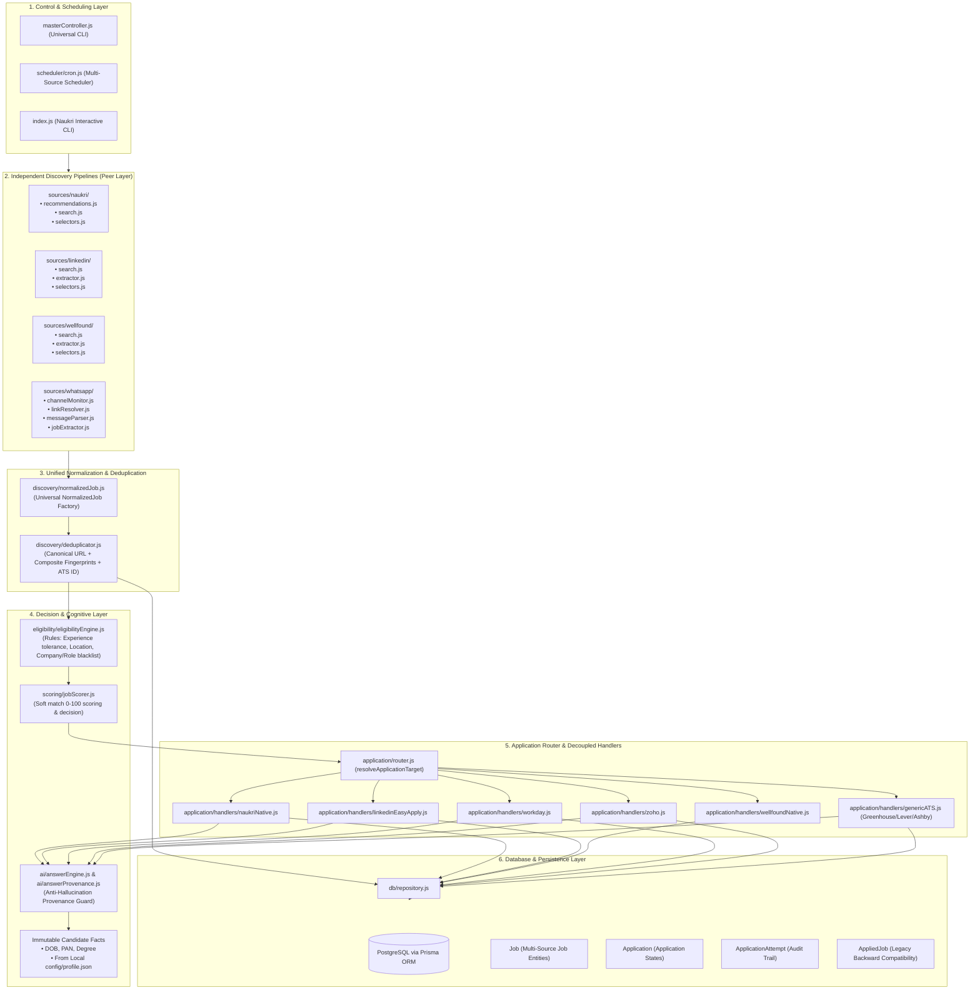
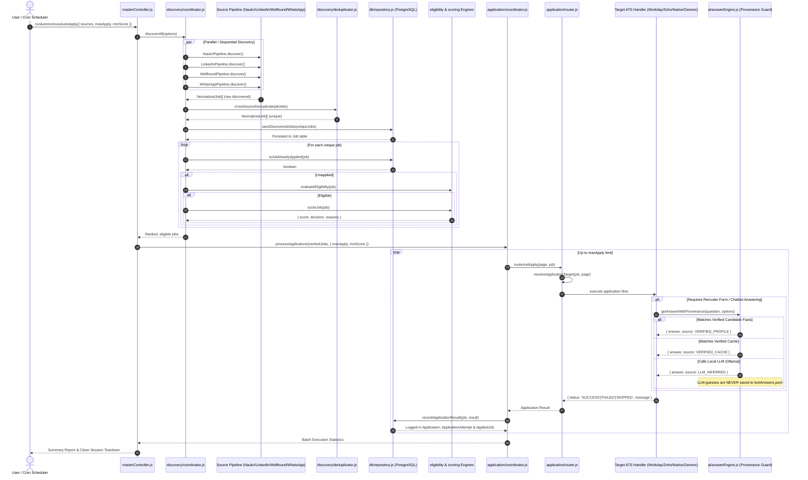

# System Architecture — Autonomous Multi-Source Job Discovery & Application Platform

The **Autonomous Job Platform** is an enterprise-grade, multi-source autonomous job discovery, deduplication, eligibility filtering, and application system. It discovers job openings across four independent peer pipelines (**Naukri**, **LinkedIn**, **Wellfound**, and **WhatsApp Channels**), normalizes listings into a unified schema, performs cross-source deduplication, filters against strict candidate eligibility constraints, scores opportunities using local LLMs (Ollama / LMStudio), and executes applications across native flows and external Applicant Tracking Systems (**Workday**, **Zoho Recruit**, **Greenhouse**, **Lever**, **Ashby**, and custom ATS forms).

---

## 1. High-Level Multi-Source Architecture



---

## 2. Universal Sequence Diagram



---

## 3. Directory & File Breakdown

```
naukri-autoapply/
├── masterController.js             # Universal multi-source entrypoint & CLI orchestrator
├── test-suite.js                   # Comprehensive automated regression & unit test suite
├── index.js                        # Legacy interactive CLI (delegates to modern layers)
│
├── discovery/                      # Universal Discovery Subsystem
│   ├── normalizedJob.js            # Universal NormalizedJob contract & fingerprinting
│   ├── deduplicator.js             # Canonical URL, ATS ID & composite deduplication
│   └── coordinator.js              # Runs all sources, dedups, persists, filters & ranks
│
├── sources/                        # Peer Source Discovery Pipelines
│   ├── naukri/                     # Naukri Discovery Pipeline
│   │   ├── index.js                # NaukriPipeline class
│   │   ├── search.js               # Multi-pass keyword search, date sort, exp slider
│   │   ├── recommendations.js      # Recommended jobs parser
│   │   └── selectors.js            # Scoped DOM selectors
│   ├── linkedin/                   # LinkedIn Discovery Pipeline
│   │   ├── index.js                # LinkedInPipeline class
│   │   ├── search.js               # Easy Apply & past-24h search filters
│   │   ├── extractor.js            # Job card parser & normalizer
│   │   └── selectors.js            # Scoped DOM selectors
│   ├── wellfound/                  # Wellfound (AngelList) Discovery Pipeline
│   │   ├── index.js                # WellfoundPipeline class
│   │   ├── search.js               # Startup roles & location search
│   │   ├── extractor.js            # Job listing card parser
│   │   └── selectors.js            # Scoped DOM selectors
│   └── whatsapp/                   # Independent WhatsApp Channels Pipeline
│       ├── index.js                # WhatsAppPipeline class (browser & message batch)
│       ├── channelMonitor.js       # WhatsApp Web channel DOM scraper
│       ├── linkResolver.js         # Redirect follower & URL unshortener
│       ├── messageParser.js        # Deterministic regex + Ollama structured JSON fallback
│       └── jobExtractor.js         # Destination page scraper & Normalizer
│
├── application/                    # Application Execution & Routing Subsystem
│   ├── router.js                   # Universal router (resolveApplicationTarget & dispatch)
│   ├── coordinator.js              # Sequential batch applicator & rate limiter
│   └── handlers/                   # Decoupled ATS Application Handlers
│       ├── naukriNative.js         # Naukri native 1-click & chatbot drawer flow
│       ├── linkedinEasyApply.js    # LinkedIn Easy Apply multi-step modal flow
│       ├── wellfoundNative.js      # Wellfound 1-click & custom pitch note flow
│       ├── workday.js              # Workday career portal automation
│       ├── zoho.js                 # Zoho Recruit candidate portal & multi-step forms
│       └── genericATS.js           # Generic external career forms (Greenhouse, Lever, Ashby)
│
├── eligibility/                    # Hard Constraint Rejection Subsystem
│   ├── rules.js                    # Predicate rules (experience tolerance, company/role blacklist)
│   └── eligibilityEngine.js        # Rule evaluator and filter engine
│
├── scoring/                        # Soft Match AI Scoring Subsystem
│   └── jobScorer.js                # 0-100 rubric scoring & APPLY/REVIEW/SKIP decisions
│
├── ai/                             # Anti-Hallucination Cognitive Answer Engine
│   ├── answerEngine.js             # Question responder with immutable candidate facts
│   ├── answerProvenance.js         # AnswerSource & Confidence metadata definitions
│   ├── ollama.js                   # Local Ollama connection & inference (qwen2.5:7b)
│   ├── lmstudio.js                 # Local LMStudio client
│   └── prompts.js                  # Candidate system prompts & PDF resume context
│
├── db/                             # Persistence & State Management
│   ├── repository.js               # Multi-entity CRUD (Job, Application, ApplicationAttempt)
│   ├── queries.js                  # Legacy query compatibility wrapper
│   └── prisma.js                   # Prisma client singleton
│
├── prisma/
│   └── schema.prisma               # Relational PostgreSQL schema (Job, Application, AppliedJob)
│
├── automation/                     # Browser Engine & Legacy Adapters
│   ├── browser.js                  # Playwright launcher with persistent context
│   ├── login.js                    # Persistent session verification
│   ├── apply.js                    # Delegating compatibility wrapper
│   ├── searchJobs.js               # Delegating compatibility wrapper
│   ├── externalApplyHandler.js     # Legacy external application handler
│   ├── workdayHandler.js           # Legacy Workday automation handler
│   └── resumeSelector.js           # Role-based PDF resume selector
│
├── config/
│   ├── profile.json                # Verified candidate profile (Facts, DOB, PAN, Degree)
│   ├── settings.js                 # Global timeouts, delays, limits, and selectors
│   └── blacklist.json              # Excluded companies and non-tech titles
│
├── scheduler/
│   └── cron.js                     # Multi-source unattended cron scheduler
└── data/
    ├── textAnswers.json            # Human-verified text answer cache (NO LLM guesses)
    └── optionsAnswers.json         # Human-verified multiple-choice answer cache
```

---

## 4. Candidate Verified Facts (Immutable Ground Truth)

The Cognitive Answer Engine enforces strict candidate facts that cannot be overridden by LLM inferences:

| Field | Example Ground Truth Value | Source |
|---|---|---|
| **Full Name** | Jane Doe | `config/profile.json` |
| **Email** | jane.doe@example.com | `config/profile.json` |
| **Mobile** | +91 9876543210 | `config/profile.json` |
| **Date of Birth (DOB)** | **01/01/2001** (01 January 2001) | `config/profile.json` & `answerEngine.js` |
| **PAN Card Number** | **ABCDE1234F** | `config/profile.json` & `answerEngine.js` |
| **Degree & Major** | **Bachelor of Technology** in Computer Science | `config/profile.json` |
| **University** | Example Institute of Technology | `config/profile.json` |
| **Tenure** | August 2020 – May 2024 | `config/profile.json` |
| **Passout / Graduation Year** | **2024** | `config/profile.json` |
| **Currently Pursuing** | **false** (completed course requirements / seeking full-time) | `config/profile.json` |
| **Experience** | 1 Year (configurable; tolerance for 0-2 YOE postings) | `config/profile.json` |
| **Notice Period** | Immediate (0 days) | `config/profile.json` |
| **Current CTC** | ₹0 (or 0 LPA) | `config/profile.json` |
| **Expected CTC** | ₹8,00,000 (8 LPA) | `config/profile.json` |
| **Address** | 123 Innovation Way, Tech Park, Bangalore, Karnataka, 560001 | `config/profile.json` |

---

## 5. How to Run & CLI Commands

### 1. Run Comprehensive Test Suite (44 Automated Tests)
Validates NormalizedJob contracts, cross-source deduplication, hard eligibility rules, anti-hallucination provenance, ATS resolution, and all four source pipelines:
```bash
npm test
# or
node test-suite.js
```

### 2. Multi-Source Autonomous Execution (`masterController.js`)

#### Apply Across All 4 Sources (Naukri + LinkedIn + Wellfound + WhatsApp):
```bash
npm run autoapply:all
# or
node masterController.js --sources=naukri,linkedin,wellfound,whatsapp --max=20 --min-score=50
```

#### Safe Dry-Run Mode (Test discovery, deduplication, scoring, and routing without clicking submit):
```bash
npm run autoapply:dry
# or
node masterController.js --sources=naukri,linkedin,wellfound,whatsapp --dry-run
```

#### Headless Execution:
```bash
node masterController.js --sources=naukri,linkedin,wellfound,whatsapp --headless --max=15
```

#### Run Specific Pipeline Only:
```bash
# Run LinkedIn Easy Apply only:
node masterController.js --sources=linkedin --max=10

# Run Wellfound startup pipeline only:
node masterController.js --sources=wellfound --max=10

# Run Naukri search & recommendations:
node masterController.js --sources=naukri --mode=both --max=10
```

### 3. Running WhatsApp Live Channel Monitoring Daemon
Watches real-time incoming messages on the configured channel (`https://whatsapp.com/channel/0029Vb6KXjg2Jl8LVXUr5X25`):
```bash
npm run whatsapp:watch
```
Or process individual messages via script:
```bash
node -e "
const { WhatsAppPipeline } = require('./sources/whatsapp');
const pipe = new WhatsAppPipeline();
pipe.processRawMessages([
  'Hiring for AI Engineer at Sallet IT Soft. Experience: 0-2 Years. Apply: https://careers.salletitsoft.com/jobs/123'
]).then(jobs => console.log(jobs));
"
```

### 4. Background Scheduled Automation (`scheduler/cron.js`)
Runs daily at 10:00 AM (configured via `CRON_SCHEDULE`):
```bash
npm run scheduler
# or
node scheduler/cron.js
```

### 5. Legacy Interactive Naukri CLI (`index.js`)
```bash
npm start
# or
node index.js
```

